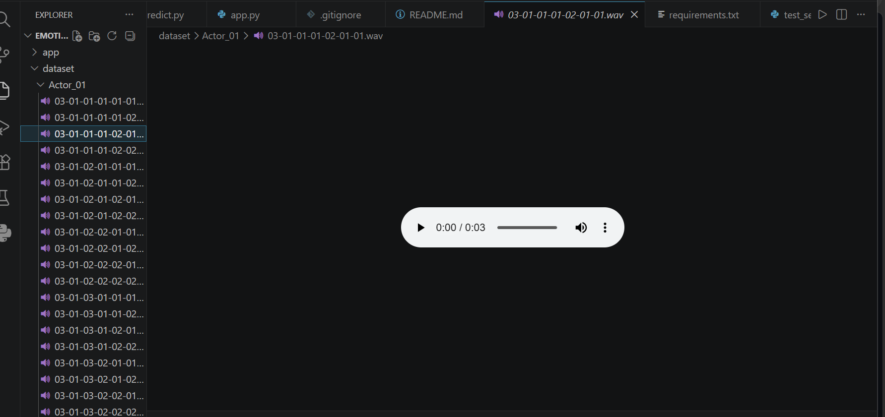
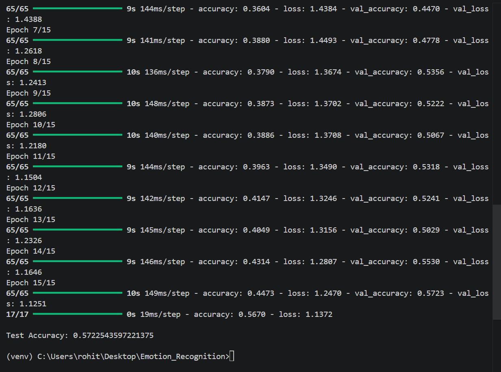
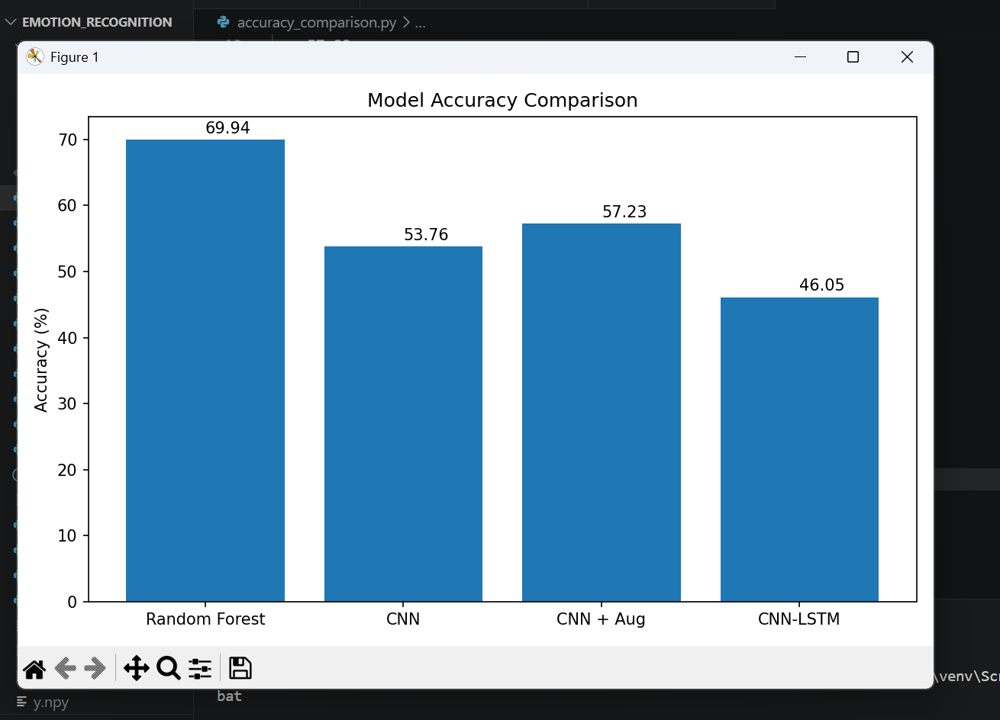
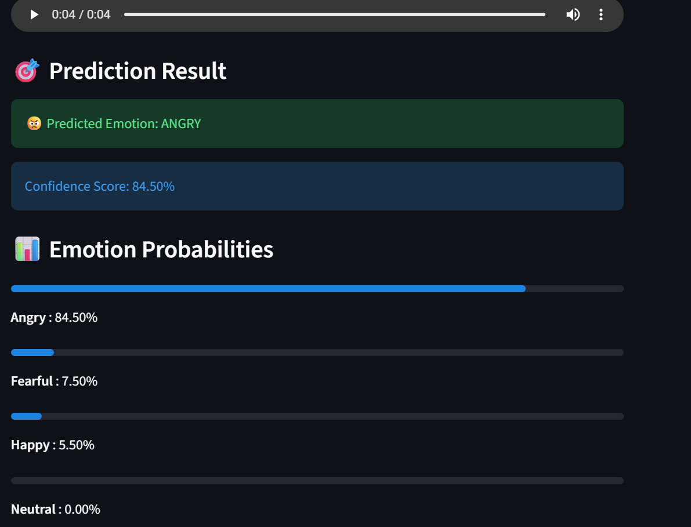

# 🎤 Speech Emotion Recognition System

## 📌 Project Overview

Speech Emotion Recognition (SER) is an important application of Artificial Intelligence that enables machines to identify human emotions from speech signals. This project aims to classify emotions from audio recordings using Machine Learning and Audio Signal Processing techniques.

The system analyzes speech audio, extracts meaningful acoustic features, and predicts the emotional state of the speaker. A web-based interface is developed using Streamlit to allow users to upload audio files and receive emotion predictions in real time.


## 🏆 Final Model

**Selected Model:** Random Forest Classifier

**Accuracy:** 69.94%

The Random Forest model achieved the highest accuracy among all tested approaches and was selected for deployment in the Streamlit application.

---

# 🎯 Objectives

* Develop an AI system capable of recognizing emotions from speech recordings.
* Extract meaningful speech features using audio signal processing techniques.
* Compare Machine Learning and Deep Learning approaches for emotion classification.
* Deploy the best-performing model through an interactive web application.

---

# 😊 Supported Emotions

The system classifies speech into the following emotions:

* Happy 😊
* Sad 😢
* Angry 😠
* Fearful 😨
* Neutral 😐

---

# 📂 Dataset

### RAVDESS (Ryerson Audio-Visual Database of Emotional Speech and Song)

The project utilizes the RAVDESS emotional speech dataset, which contains professionally recorded speech samples from multiple actors expressing different emotions.

### Dataset Characteristics

* 24 Professional Actors
* High-quality WAV Audio Files
* Multiple Emotional Categories
* Emotion-Labeled Speech Recordings

For this project, the following emotion categories were selected:

| Emotion | Code |
| ------- | ---- |
| Neutral | 01   |
| Happy   | 03   |
| Sad     | 04   |
| Angry   | 05   |
| Fearful | 06   |

### Dataset Size

* Original Samples: 864 Audio Files
* Augmented Samples: 2592 Audio Files

---

# ⚙️ Project Workflow

## Step 1: Dataset Preparation

* Downloaded and organized the RAVDESS dataset.
* Parsed audio filenames to extract emotion labels.
* Created a structured dataset containing audio paths and corresponding emotions.

### Output

```text
Total Samples: 864
```

---

## Step 2: Audio Preprocessing

Each audio file was processed using Librosa.

### Preprocessing Steps

* Audio Loading
* Noise Handling
* Signal Normalization
* Fixed Duration Processing
* Feature Extraction Preparation

---

## Step 3: Feature Extraction

The most important stage of the project involved extracting acoustic features from speech signals.

### Extracted Features

#### MFCC (Mel-Frequency Cepstral Coefficients)

MFCCs capture the spectral characteristics of speech and are widely used in speech recognition systems.

```text
40 MFCC Features
```

#### Additional Features

* Chroma Features
* Spectral Centroid
* Zero Crossing Rate
* RMS Energy

---

## Step 4: Baseline Machine Learning Model

A Random Forest Classifier was trained using extracted MFCC features.

### Why Random Forest?

* Fast Training
* Good Generalization
* Effective on Small Datasets
* Less Prone to Overfitting

### Result

```text
Accuracy: 69.94%
```

---

## Step 5: Deep Learning Experiments

To explore advanced approaches, multiple deep learning architectures were implemented and evaluated.

### CNN Model

A Convolutional Neural Network was trained using MFCC feature maps.

#### Result

```text
Accuracy: 53.76%
```

---

### Data Augmentation

To increase training data diversity, augmentation techniques were applied.

#### Techniques Used

* Noise Injection
* Pitch Shifting

#### Dataset Expansion

```text
864 Samples → 2592 Samples
```

---

### CNN with Augmented Dataset

The CNN model was retrained using augmented data.

#### Result

```text
Accuracy: 57.23%
```

---

### CNN-LSTM Hybrid Model

A hybrid architecture combining CNN and LSTM layers was implemented to capture both spatial and temporal speech characteristics.

#### Result

```text
Accuracy: 46.05%
```

---

# 📊 Model Performance Comparison

| Model              | Accuracy |
| ------------------ | -------- |
| Random Forest      | 69.94%   |
| CNN                | 53.76%   |
| CNN + Augmentation | 57.23%   |
| CNN-LSTM           | 46.05%   |

---

# 🏆 Best Performing Model

### Random Forest Classifier

The Random Forest model achieved the highest accuracy and demonstrated the best generalization performance on the RAVDESS dataset.

Reasons for superior performance:

* Small dataset size
* Reduced overfitting
* Efficient feature-based learning
* Robust classification capability

---

# 🚀 Deployment

A Streamlit-based web application was developed for real-time emotion prediction.

### Features

* Upload WAV Audio Files
* Audio Playback Support
* Emotion Prediction
* Confidence Score Display
* Emotion Probability Visualization
* User-Friendly Interface

### Workflow

```text
User Uploads Audio
        ↓
Audio Preprocessing
        ↓
MFCC Feature Extraction
        ↓
Random Forest Model
        ↓
Emotion Prediction
        ↓
Result Display
```

---

# 🎯 Demo

The deployed Streamlit application allows users to upload WAV audio recordings and receive real-time emotion predictions.

### Example Output

| Input Audio | Predicted Emotion |
|------------|------------------|
| Happy Speech | 😊 Happy |
| Sad Speech | 😢 Sad |
| Angry Speech | 😠 Angry |
| Fearful Speech | 😨 Fearful |
| Neutral Speech | 😐 Neutral |

The system extracts MFCC features from the uploaded speech signal and uses the trained Random Forest classifier to predict the speaker's emotional state.

# 📁 Project Structure

speech-emotion-recognition/
│
├── dataset/
│   ├── Actor_01
│   ├── Actor_02
│   └── ...
│
├── models/
│   ├── emotion_rf_model.pkl
│   ├── cnn_emotion_model.keras
│   └── cnn_lstm_emotion.keras
│
├── screenshots/
│   ├── dataset_structure.png
│   ├── training_results.png
│   ├── accuracy_comparison.png
│   └── streamlit_app.png
│
├── outputs/
│
├── app.py
├── predict.py
├── feature_extraction.py
├── train_model.py
├── save_rf_model.py
├── requirements.txt
└── README.md
---

---

# 🛠 Technologies Used

### Programming Language

* Python

### Libraries

* NumPy
* Pandas
* Librosa
* Scikit-Learn
* TensorFlow
* Keras
* Streamlit
* Joblib

### Machine Learning

* Random Forest Classifier

### Deep Learning

* CNN
* CNN + Data Augmentation
* CNN-LSTM

### Audio Processing

* MFCC Extraction
* Chroma Features
* Spectral Analysis

---

# 📸 Project Screenshots

## Dataset Structure



## Model Training Results



## Accuracy Comparison



## Streamlit Application



---

# 🔮 Future Enhancements

* Integration of Multiple Emotion Datasets (TESS, EMO-DB)
* Real-Time Microphone Input
* Support for Additional Emotions
* Advanced Transformer-Based Models
* Wav2Vec 2.0 Integration
* Improved Noise Robustness
* Cloud Deployment

---

# 📈 Key Learnings

Through this project, the following concepts were explored:

* Audio Signal Processing
* Speech Feature Extraction
* MFCC Analysis
* Emotion Classification
* Machine Learning Algorithms
* Deep Learning Architectures
* Model Evaluation
* Data Augmentation
* Streamlit Deployment
* End-to-End AI Project Development

---

# ✅ Conclusion

# ✅ Conclusion

This project successfully developed an end-to-end Speech Emotion Recognition system using audio signal processing and machine learning techniques.

Multiple models including Random Forest, CNN, CNN with Augmentation, and CNN-LSTM were implemented and evaluated. Among them, the Random Forest classifier achieved the best performance with 69.94% accuracy and was selected for deployment.

The final solution was integrated into a Streamlit web application capable of predicting emotions from uploaded speech recordings in real time.
